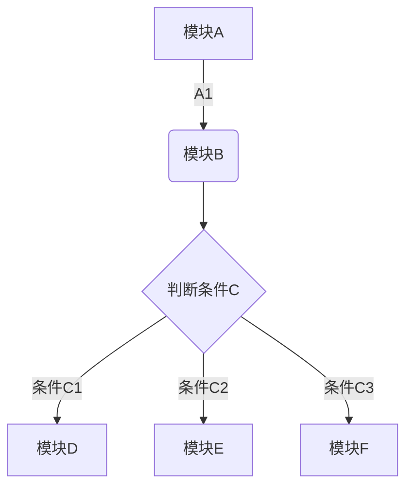
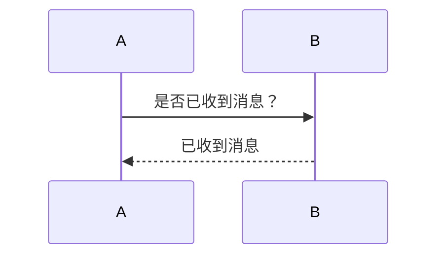
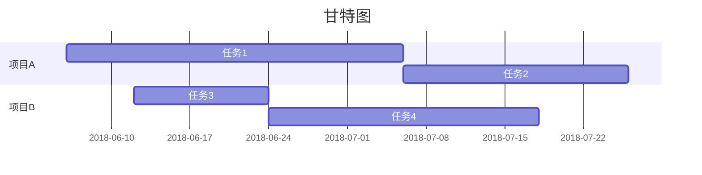

+ 写博客有时候需要使用流程图来说明整个工程，或者整个项目的一个大致流程；
+ 一些笔记软件中也已经相继支持流程图的解析，但是默认安装的Hexo是不支持流程图解析的；
+ 所以需要将流程图支持的模块安装到Hexo中，才能解析Markdown中的流程图；

+ 下面是Hexo安装流程图模块的教程，主要包括：
    + 模块选择
    + 模块安装和设置
    + 流程图绘制例子


<!-- More -->

## 模块选择

目前的流程图模块主流的有3个，包括：

+ mermaid模块


+ flowchart模块


+ sequence模块


mermaid支持流程、时序、甘地图，写法简便，最受欢迎，是流程图中的最大玩家。其他的两个是小众，但相当淡雅的玩家，不追求颜色多样，只是简单的纯黑色样式。    
个人还是首推mermaid的，多样化，选择更多；如果你是一位算法爱好者，理论研究人员，不追求流程图的颜色、搭配，喜欢黑白样式的流程图，那可以选择后两者。

所以，以下的教程将以mermaid安装进行介绍，其他的两种模块可以参考官方教程进行安装：
+ flowchart官方：https://github.com/bubkoo/hexo-filter-flowchart
+ sequence官方：https://github.com/bubkoo/hexo-filter-sequence

## 模块安装
+ 安装模块
```
#npm安装
npm install hexo-filter-mermaid-diagrams

```
+ 配置文件
```
#编辑hexo的配置文件，_config.yml，追加以下内容
# mermaid chart
mermaid: ## mermaid url https://github.com/knsv/mermaid
  enable: true  # default true
  version: "7.1.2" # default v7.1.2
  options:  # find more api options from https://github.com/knsv/mermaid/blob/master/src/mermaidAPI.js
  #startOnload: true  // default true
---

#编辑NexT主题的脚注文件，即./themes/next/layout/_partials/footer.swig，追加以下内容

  <script src='https://unpkg.com/mermaid@<%= theme.mermaid.version %>/dist/mermaid.min.js'></script>
    <script>
    if (window.mermaid) {
      mermaid.initialize({theme: 'forest'});
    }
  </script>

      

```
## 一个栗子
利用mermaid绘制流程图、时序图以及甘地图。

+ 流程图
```#mermaid
graph TD#方向：TD上到下，LR左到右，RL右道左
A[模块A] -->|A1| B(模块B)
B --> C{判断条件C}
C -->|条件C1| D[模块D]
C -->|条件C2| E[模块E]
C -->|条件C3| F[模块F]
```



+ 时序图
```#mermaid
sequenceDiagram
A->>B: 是否已收到消息？
B-->>A: 已收到消息
```



+ 甘特图
```#mermaid
gantt
title 甘特图
dateFormat  YYYY-MM-DD
section 项目A
任务1      :a1, 2018-06-06, 30d
任务2      :after a1  , 20d
section 项目B
任务3      :2018-06-12  , 12d
任务4      : 24d
```




## 参考

https://www.liuyude.com/How_to_make_your_HEXO_blog_support_handwriting_flowchart.html
https://tyloafer.github.io/2018/04/21/hexo-mermaid/
https://github.com/knsv/mermaid
https://github.com/bubkoo/hexo-filter-flowchart
https://github.com/bubkoo/hexo-filter-sequence

